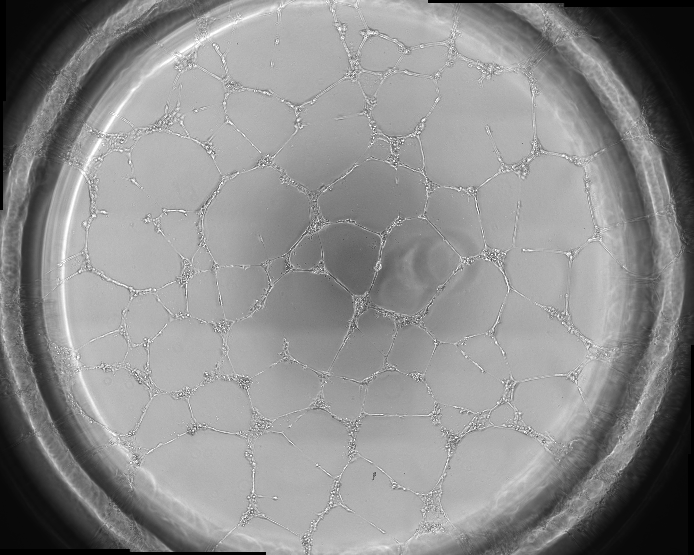
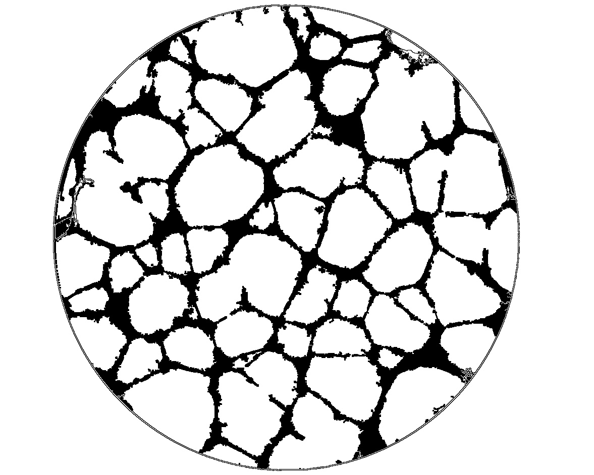

# Angiogenesis analyzer
This project is done for the Biomedicine, Biotechnology and Public Healthcare of the University of Cádiz. They idea is to automatize the processing of the microscopic images of their experiments related to angiogenesis.

- The microscope takes images in a defined interval and are stored in a tif file,the images look like this one:

- The code takes the tif file and process the image returning the following images:
    
    

   - A csv with the results showing:
      - frame
      - number of joints
      - number of meshes
      - total meshes area in pixels
      - total meshes area in nm
      - average meshes area in pixels
      - average meshes area in nm
      - number of segments
      - total segments length in pixels
      - total segments length in nm

Do you want to automate your image analyses? Contact me through [LinkedIn](https://www.linkedin.com/in/pablocastilla) and let's talk.

## Use the program
1. Go to [releases](https://github.com/pablocastilla/angiogenesis-analyzer/releases/) and grab the latest one. 
2. Put the exe in a folder, create a folder called videos and put the tif files inside it
3. Execute process_tiff, a folder called analysis will be created with the analysis result 

## Work with the code
### Create environment
1. Install python 3.7 amd64 adding it to the path
2. https://docs.python.org/3/library/venv.html
3. python -m venv ./venv
4. activate
5. pip install final-requirements.txt

### Process
- Each tif has different frames in it and each frame is processed doing the following:

   1. Extract the frame
   2. Resize the frame
   3. Contours are found using opencv
   4. Image is skeletonized
   5. Inner graph is found using the skeleton and the contours
   6. Selected measures are calculated and returned (number of joins, number of meshes, total meshes area, number of segments, total segments length)

- After every frame is processed a csv is created and saved in the analysis folder with the results

### Create executable
From the terminal with the environment activated type
- pyinstaller --onefile process_tiff.py

